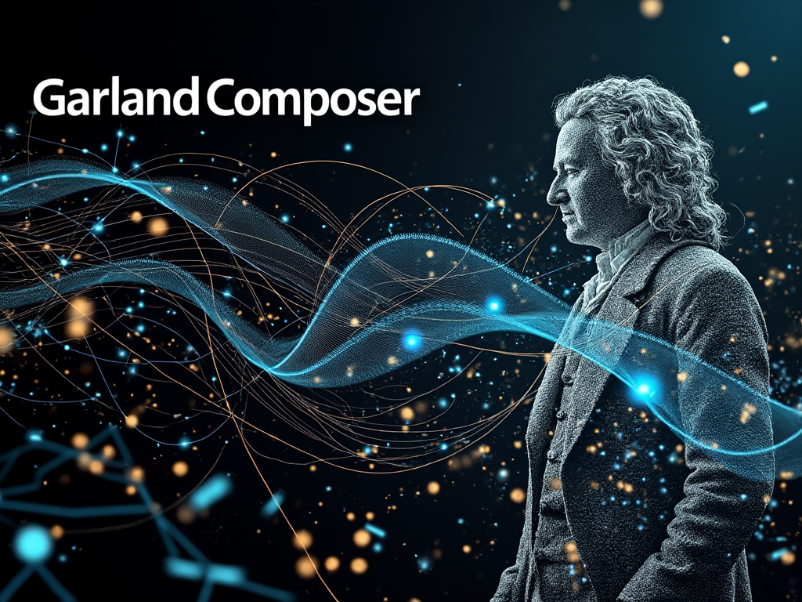
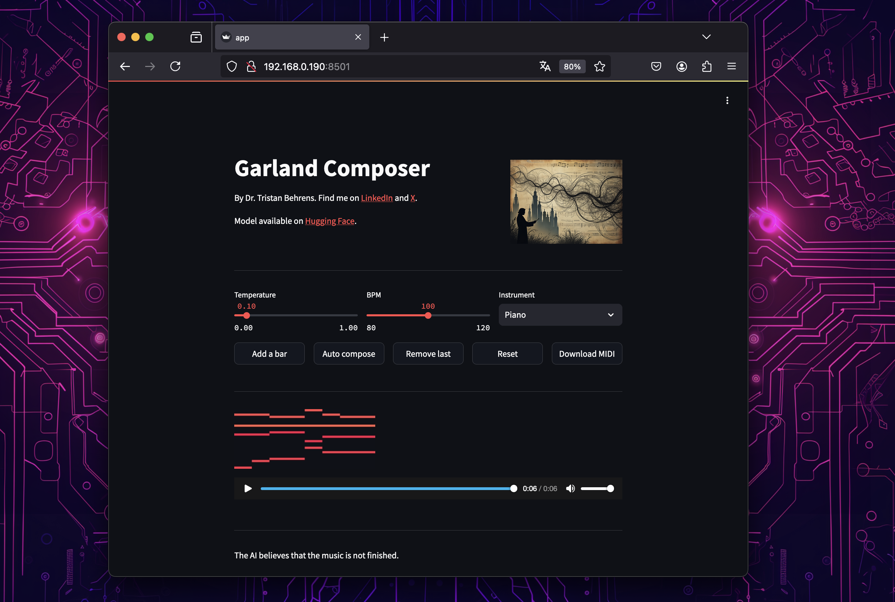

# Garland Composer
## Generative Music with Small Language Models by Dr. Tristan Behrens



This Streamlit application demonstrates how to compose music using Small Language Models. Designed for users of all skill levels, it provides a simple and interactive interface to generate melodies, harmonies, and full compositions using AI. The application showcases the potential of Small Language Models in the field of music composition.



## How to install

This repo is tested on Unix with and without GPU acceleration. It is very likely that the project will work on Mac. As always, if you want to run it on Windows, I suggest getting another machine. 🤗

Try this:

```
conda create -n "garland-composer" python=3.11.9
conda activate garland-composer
pip install -r pre-requirements.txt
pip install -r requirements.txt
```

After that you can run with:

```
sh start.sh
```

## More Generative Music Models

You will find more compatible models on [Hugging Face](https://huggingface.co/collections/TristanBehrens/bach-garland-music-models-66d6df85ddf54fd90930288d).

Also there is a [Hugging Face Space available](https://huggingface.co/spaces/TristanBehrens/Garland-Composer) that is very close to this implementation.

## Star History

[](https://star-history.com/#AI-Guru/garland-composer&Date)


## Acknowledgements

This work is sponsored by [KI Salon](https://www.ki-salon.net/), who is a strong supporter of open-source AI.


## Get in touch and get involved

Do not hesitate to report any issues that you might find [here](https://github.com/AI-Guru/garland-composer/issues). And please connect on [LinkedIn](https://de.linkedin.com/in/dr-tristan-behrens-734967a2). We are happy about everyone who says "hello".

If you want to contribute, please fork the repository and send pull requests. Looking forward! Since this is an open-source project we are most eager for you to participate.

And if you want to join as a developer, let us know!


# THANKS!
